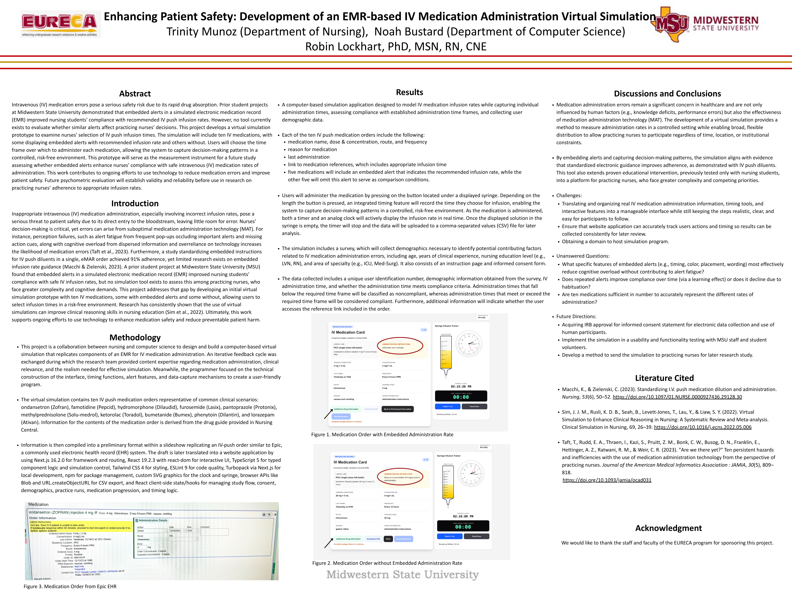

# EURECA IV Medication Administration Simulation

Interactive web simulation for practicing timed IV push medication administration in a guided research workflow.

Presented at UGRCAF 2026 (Undergraduate Research and Creative Activities Forum) through the EURECA undergraduate research program at Midwestern State University.

## Research poster



## Why this project matters

Nursing IV push administration requires both dosage accuracy and timing compliance. This project provides a structured simulation where participants complete consent and demographics, administer medications in a controlled interface, and export timing/compliance data for analysis.

## Core capabilities

- Guided participant flow: consent, demographics, practice run, simulation, summary
- Interactive syringe trainer with room clock and elapsed-time tracking
- Medication order context: dose, route, frequency, instructions, and line details
- Optional additional drug-reference view per medication
- Automated compliance evaluation against required minimum administration time
- CSV export for downstream analysis in Excel or statistical tools

## Tech stack

- Next.js 16 (App Router)
- React 19
- TypeScript (strict mode)
- Tailwind CSS v4
- ESLint (Next.js + TypeScript rules)

## Local development

### Prerequisites

- Node.js 20+
- npm 10+

### Install

```bash
git clone https://github.com/noahbustard/EURECA_IV_APP.git
cd EURECA_IV_APP
npm install
```

### Run

```bash
npm run dev
```

Open <http://localhost:3000>.

## Scripts

- `npm run dev`: start development server
- `npm run lint`: run ESLint across the repository
- `npm run typecheck`: run TypeScript type checking (`tsc --noEmit`)
- `npm run build`: create production build
- `npm run start`: run production build locally
- `npm run verify`: run lint + typecheck + build

## Environment configuration

This project currently has no required runtime environment variables.

- Optional local overrides can be placed in `.env.local`.
- Use `.env.example` as the template if environment variables are introduced later.

## Data captured in CSV export

- Participant ID
- Age
- Gender
- Level of Nursing
- Area of Nursing
- Years of Nursing Experience
- Medication
- Administration Time (seconds)
- Required Minimum Administration Time (seconds)
- Compliance Status
- Viewed Additional Drug Information
- Completed At

## Project structure

```plaintext
src/
  app/
    layout.tsx            # App shell + metadata
    page.tsx              # Main simulation UI and screen flow
    lib/simulation.ts     # Simulation domain types, constants, and pure helpers
```

## Verification status

Use the following command before opening pull requests:

```bash
npm run verify
```

## Known limitations

- No automated test suite yet (lint, typecheck, and build checks are included).
- Data is session-based in the browser and exported manually via CSV.
- This is a research simulation, not a clinical decision support or production EMR integration.

## Academic context

Research collaboration between the Wilson School of Nursing and Department of Computer Science, Midwestern State University.

## License

Developed for academic research and educational use.
